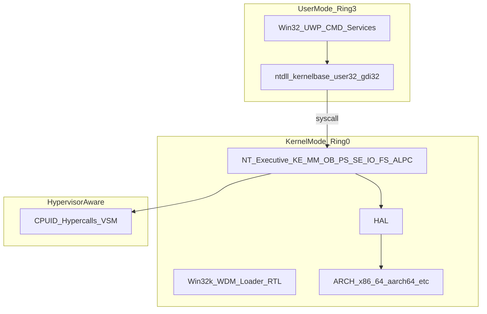

# ZirconOSFluent 架构总览（NT 10.0）

**English**: [../en/Architecture.md](../en/Architecture.md)

> **免责声明**：ZirconOSFluent 与 Microsoft 无关联。「Windows」「Windows 10」等商标归 Microsoft Corporation 所有；本文仅描述技术对标目标。

## 1. 项目定位

**ZirconOSFluent** 是本仓库的对外品牌；内核实现代号为 **NT10**，以 **Windows NT 10.0.19045**（Windows 10 21H2，仓库当前文档与 syscall 文档化的固定对标构建）为设计参照，使用 **Rust**（主体）与少量 **汇编**（`global_asm!` 或独立 `.S`）实现可维护、可扩展的 NT 语义内核。**本仓库仅面向 NT 10.0 代际能力，不包含 Windows NT 6.x 兼容或迁移目标。**

**核心取向**：

- **混合微内核**：调度、内存、中断、IPC 等在内核态；对象管理器、I/O 管理器、安全子系统等以执行体形态存在；Win32 子系统服务器可在用户态。
- **NT 语义优先**：优先 `Nt*` / `Zw*` 与 NT 对象模型，而非 POSIX 为主。
- **现代安全**：规划 VBS、HVCI、Secure Boot、TPM 2.0 抽象等（见 [Virtualization-Security-WinRT.md](Virtualization-Security-WinRT.md)）。
- **Rust 工程化**：以类型系统、`unsafe` 边界文档化、`repr(C)` 布局敏感结构、受控分配（可选 `allocator_api` / 自定义池）降低未定义行为风险。

## 2. NT 10.0 设计要点（单一代际目标）

下列为 **对标 NT 10.0** 时主动纳入的设计维度（非与旧代际的差异对照表）：

| 维度 | NT 10.0 向目标 |
|------|----------------|
| 引导 | **仅 UEFI**，ZBM10 |
| IPC | **ALPC** |
| 显示 | **WDDM 2.x**（D3D12 感知）与 Fluent 桌面方向 |
| 安全 | 令牌、SID、ACL，并规划 VBS / HVCI / CET / CFG |
| 虚拟化 | **Hyper-V 感知层** |
| 运行时 | Win32 + **WinRT / UWP AppModel**（长期） |
| WOW64 | **x86/ARM32 → x64/ARM64** thunk 方向 |
| 页表 | 4 级为主，**5 级 LA57** 可选 |
| 系统调用编号 | 项目自有 ABI（见 [Syscall-ABI-ZirconOS.md](Syscall-ABI-ZirconOS.md)），文档化基准 **19041**，**不追求与任意 Windows 构建二进制一致** |

## 3. 分层架构（目标）

### 3.1 ASCII 总览（与母版一致）

```
用户态 (Ring 3)
  UWP / Win32 / CMD·PS·Terminal / 系统服务
       → ntdll / kernel32 / kernelbase / user32 / gdi32 / combase / winrt …
       → syscall
内核态 (Ring 0)
  NT 执行体：KE MM OB PS SE IO FS ALPC；Win32k / WDM / Loader / RTL
       → HAL → 架构层 (x86_64 / aarch64 / …)
Hypervisor 感知（可选）
  CPUID / 超级调用 / VSM 等
```

### 3.2 Mermaid 示意图



## 4. 目标源码树（摘要）

完整目录与文件级说明见母版 [ideas/ZirconOS_NT10_Architecture.md](../../ideas/ZirconOS_NT10_Architecture.md) 第 4 节。**本仓库 Rust 映射**：

- **UEFI ZBM10 占位**：[crates/nt10-boot-uefi/](../../crates/nt10-boot-uefi/)
- **内核库**：[crates/nt10-kernel/src/](../../crates/nt10-kernel/src/) — `arch/`、`hal/`、`ke/`、`mm/`、`ob/`、`ps/`、`se/`、`io/`、`alpc/`、`fs/`、`loader/`、`hyperv/`、`vbs/`、`drivers/`、`libs/`、`servers/`、`subsystems/win32/`、`desktop/fluent/` 等（与母版 `src/` 子树同名对应）
- **链接脚本（桩）**：[link/x86_64.ld](../../link/x86_64.ld)

## 5. 当前实现 vs 目标架构（本仓库）

| 范围 | 本仓库现状 | 目标（母版） |
|------|------------|--------------|
| 内核代码 | **[crates/nt10-kernel](../../crates/nt10-kernel/)**：`#![no_std]` 库，模块树与母版 §4 对齐，占位实现 | 完整 NT10 内核行为 |
| 引导 | **[crates/nt10-boot-uefi](../../crates/nt10-boot-uefi/)**：`efi_main`、GOP/内存图/handoff、从 FAT 加载 `NT10KRNL.BIN` 并跳转至 1 MiB 入口 | ZBM10、BCD、Secure Boot、完整 PE 加载 |
| Fluent 桌面 | [desktop/fluent/](../../crates/nt10-kernel/src/desktop/fluent/) 模块桩；[resources/](../../resources/) | Win32k/WDDM 全栈 + Shell |
| 构建 | **[Cargo.toml](../../Cargo.toml)** 工作区；`cargo check -p nt10-kernel --target x86_64-unknown-none`；别名 `cargo kcheck`（见 [.cargo/config.toml](../../.cargo/config.toml)） | ISO、QEMU 一键脚本、特性开关等（后续 `xtask` 或脚本） |

因此：**本文档描述的是 NT10 内核与桌面的目标架构**；若需了解**当前可构建产物**，请以根目录 [README.md](../../README.md)、[Build-Test-Coding.md](Build-Test-Coding.md) 与 `cargo check` 为准。

## 6. 相关文档

- [Roadmap-and-TODO.md](Roadmap-and-TODO.md)
- [References-Policy.md](References-Policy.md)
- [Syscall-ABI-ZirconOS.md](Syscall-ABI-ZirconOS.md)
- [Kernel-Executive-and-HAL.md](Kernel-Executive-and-HAL.md)
- [Loader-Win32k-Desktop.md](Loader-Win32k-Desktop.md)
