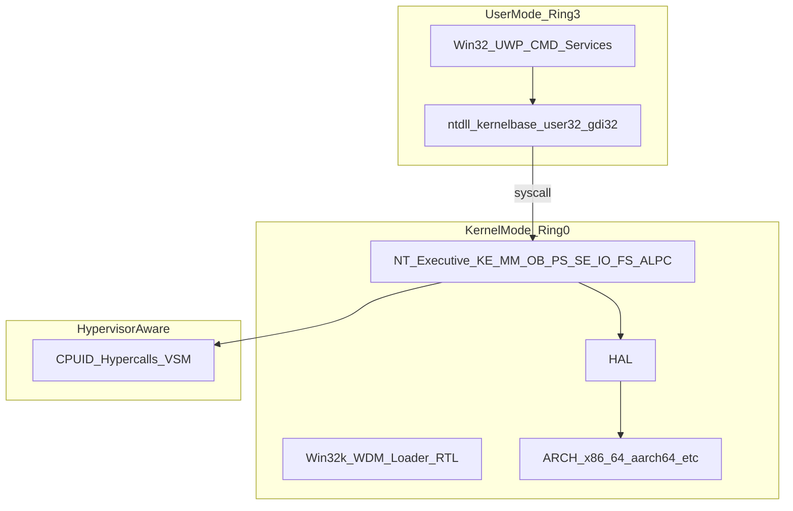

# ZirconOS NT10 architecture overview

**中文**：[../cn/Architecture.md](../cn/Architecture.md)

> **Disclaimer**: ZirconOS is not affiliated with Microsoft. “Windows” and “Windows 10” are trademarks of Microsoft Corporation; this text describes compatibility goals only.

## 1. Project positioning

**ZirconOS NT10** (the kernel generation this repo’s **ZirconOSFluent** work targets) uses **Windows NT 10.0.19045** (Windows 10 21H2, last mainstream kernel build) as a design reference, implemented primarily in **Rust** with a small amount of **assembly** (`global_asm!` or standalone `.S`) for low-level architecture code.

**Core direction**:

- **Hybrid microkernel**: scheduling, memory, interrupts, IPC in kernel mode; object manager, I/O manager, security, etc. as executive components; Win32 subsystem servers may run in user mode.
- **NT semantics first**: prefer `Nt*` / `Zw*` and the NT object model over POSIX-centric APIs.
- **Modern security**: VBS, HVCI, Secure Boot, TPM 2.0 abstractions (see [Virtualization-Security-WinRT.md](Virtualization-Security-WinRT.md)).
- **Rust engineering**: types, documented `unsafe` boundaries, `repr(C)` for layout-sensitive structures, controlled allocation (custom pools / future `allocator` traits) to reduce UB.

**Upstream reference** (from the draft): ZirconOSAero (NT 6.1).

## 2. Main differences vs NT 6.1

| Area | NT 6.1 | NT 10.0 (target) |
|------|--------|------------------|
| Boot | ZBM (BIOS/MBR + UEFI) | **UEFI only**, ZBM10 |
| Syscalls | NT 6.1 numbers | **NT 10** (19041 baseline) |
| IPC | LPC | **ALPC** |
| Display | XPDM / WDDM 1.x | **WDDM 2.x** (D3D12-aware) |
| Security | Token, SID, ACL | + VBS / HVCI / CET / CFG |
| Virtualization | none | **Hyper-V awareness** |
| Runtime | Win32-first | Win32 + **WinRT / UWP AppModel** |
| WOW64 | PE32 → PE32+ | **x86/ARM32 → x64/ARM64** |
| Paging | 4-level | 4 / **5-level LA57 (optional)** |
| Desktop | Aero | **Fluent** (Acrylic / Mica) |

## 3. Layered architecture (target)

### 3.1 ASCII summary (same as draft)

```
User (Ring 3): UWP / Win32 / CMD·PS·Terminal / services
  → ntdll / kernel32 / kernelbase / user32 / gdi32 / combase / winrt …
  → syscall
Kernel (Ring 0): KE MM OB PS SE IO FS ALPC; Win32k / WDM / Loader / RTL
  → HAL → arch (x86_64 / aarch64 / …)
Hypervisor awareness: CPUID / hypercalls / VSM …
```

### 3.2 Mermaid



## 4. Target source tree (summary)

Full layout: [ideas/ZirconOS_NT10_Architecture.md](../../ideas/ZirconOS_NT10_Architecture.md) §4. **This repo (Rust)**:

- **UEFI ZBM10 stub**: [crates/nt10-boot-uefi/](../../crates/nt10-boot-uefi/)
- **Kernel library**: [crates/nt10-kernel/src/](../../crates/nt10-kernel/src/) — `arch/`, `hal/`, `ke/`, `mm/`, `ob/`, `ps/`, `se/`, `io/`, `alpc/`, `fs/`, `loader/`, `hyperv/`, `vbs/`, `drivers/`, `libs/`, `servers/`, `subsystems/win32/`, `desktop/fluent/`, etc.
- **Linker script (stub)**: [link/x86_64.ld](../../link/x86_64.ld)

## 5. Current repo vs target

| Area | Current | Target (draft) |
|------|---------|----------------|
| Kernel | **[crates/nt10-kernel](../../crates/nt10-kernel/)**: `#![no_std]` library, module tree aligned with §4, stub implementations | Full NT10 semantics |
| Boot | **[crates/nt10-boot-uefi](../../crates/nt10-boot-uefi/)**: `efi_main`, GOP/memory map/handoff, FAT load of `NT10KRNL.BIN`, jump to kernel at 1 MiB | ZBM10, BCD, Secure Boot, full PE loader |
| Fluent | [desktop/fluent](../../crates/nt10-kernel/src/desktop/fluent/) stubs; [resources/](../../resources/) pack | Win32k/WDDM + shell |
| Build | **[Cargo.toml](../../Cargo.toml)** workspace; `cargo check -p nt10-kernel --target x86_64-unknown-none`; `cargo kcheck` alias ([.cargo/config.toml](../../.cargo/config.toml)) | ISO/QEMU scripts, feature flags (`xtask` or scripts later) |

This document describes the **target** architecture; for **what builds today**, see the root [README.md](../../README.md), [Build-Test-Coding.md](Build-Test-Coding.md), and `cargo check`.

## 6. Related docs

- [Roadmap-and-TODO.md](Roadmap-and-TODO.md)
- [References-Policy.md](References-Policy.md)
- [Syscall-ABI-ZirconOS.md](Syscall-ABI-ZirconOS.md)
- [Kernel-Executive-and-HAL.md](Kernel-Executive-and-HAL.md)
- [Loader-Win32k-Desktop.md](Loader-Win32k-Desktop.md)
